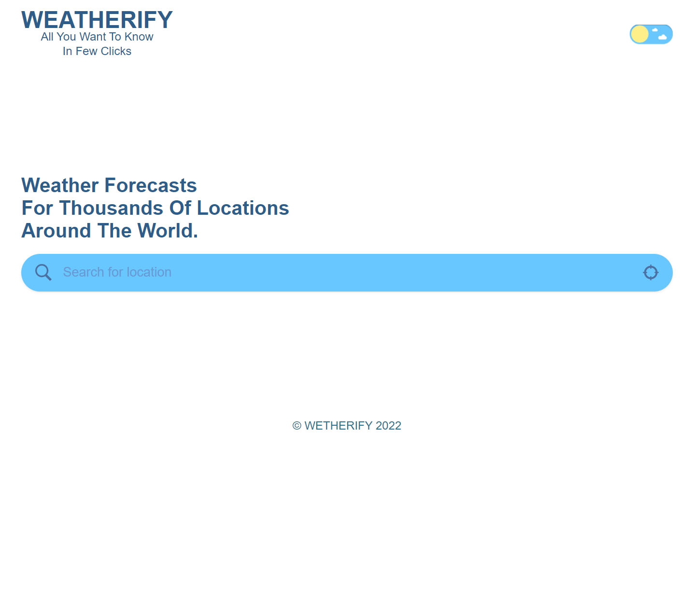
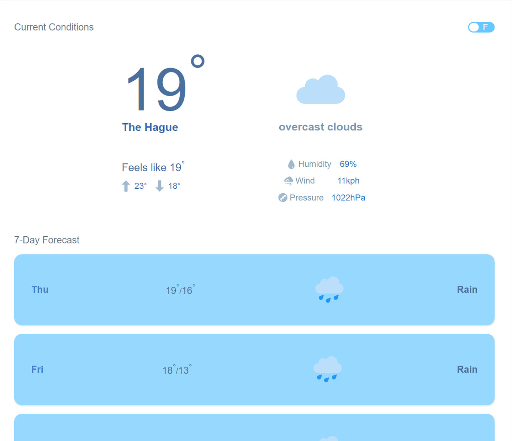

# Weatherify

<strong>Weatherify</strong> is a weather App created with react and typescript, it uses the Openweathermap API and Algolia API to weather forecasts for thousands of locations around the world.
 

### Features

- 7 days forecast.
- Find user location weather using GeolocationAPI.
- Conversion from Celcius to Fahrenheit and vice versa.
- Dark and Light Mode.

